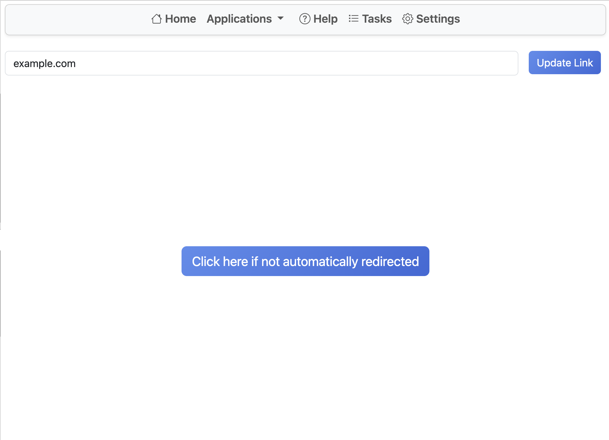

# Link Tab

This tool lets you embed links to documents associated with tabs in Onshape.
Insert an embeddable link and click **Update** to view your page inside Renaissance.
The link is associated with a specific tab ID, so it is shared across Renaissance users who have access to the Onshape document.

This tool supports creating an application tab for a full-screen document not associated with a specific Part Studio, Assembly, or Drawing.
Go to **New Tab -> Applications -> Renaissance Link Tab**.

Supported links are limited by the source. Not all links support iframes.
For some platforms, the correct embed link must be used.
Google Docs is confirmed to work.

Basic text editor functionality has been removed. Please use built-in Onshape notes.
