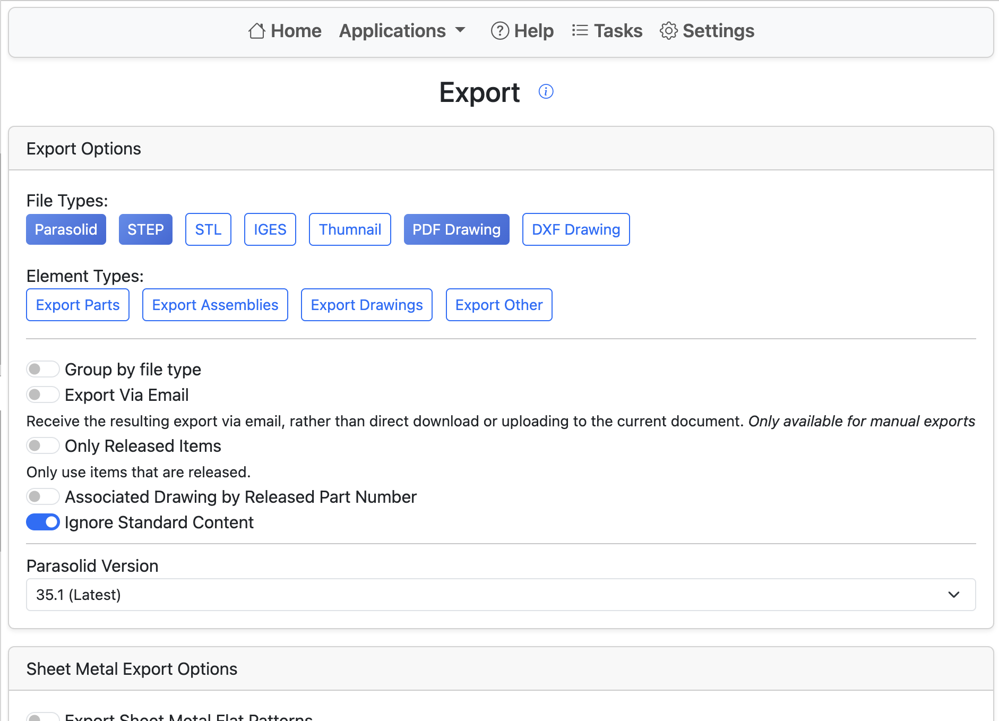

# Assembly Export

Exporting all parts, drawings, flat patterns, or sub-assemblies from a given assembly can be a difficult and time-consuming process that is prone to errors.
With the Renaissance Assembly Export tool, this process is simplified into only a few clicks.

Start by selecting file formats to export.
Renaissance currently supports the following formats:

- Parasolid
- STEP
- IGES
- PDF
- DXF

If a file format you require is missing, please contact `caden.armstrong@smartbenchsoftware.com` to request additional formats.

Next, select all of the assembly components to export.
Clicking **Start Export** will begin the export process.
If **Export via Email** is selected, you will receive an email download link when the process is complete. Otherwise, the resulting zip file will be uploaded to the default workspace of the current document.

It is important to note that including sheet metal or drawings in the export will greatly impact export speed.
The best way to mitigate this issue is to have well-organized documents. One part per document will reduce the time Renaissance spends looking for drawings.

Drawings export works by searching component documents for drawing tabs that contain views referencing the current part.
Renaissance matches both the part and the configuration of the part. If the assembly contains a configuration that is not represented in a drawing view, that drawing will not be exported.

Sheet metal flat patterns are only exported for sheet metal parts that have an Onshape-generated flat pattern.
Flat patterns are exported from the TOP view.

## Options

- **Only Released items**: Skips selected components that are not released. The exact version and configuration need to be released.
- **Ignore Standard Content**: Skips selected components that are Onshape Standard Content.

Columns in the components table are filtered by search terms that are **starts with**.
Search terms can be combined with a `+`.
