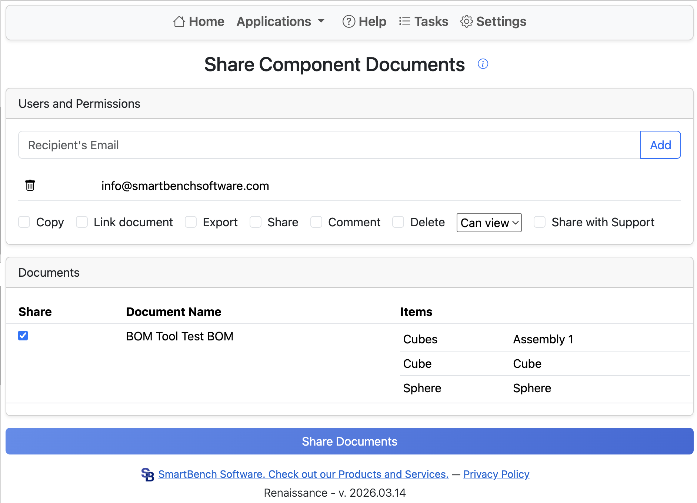

# Component Share

When designing an Onshape assembly with one part per document, sharing an assembly and all of its component documents can be difficult.
Sharing an assembly does not share all component documents, requiring users to either place all parts into a folder to share or share each individual part.
The Component Share tool fixes this by allowing you to share all component documents for a given assembly.

Start by entering the recipient email address and clicking **Add**.
To remove an email from the list, click the garbage can icon to the left of the email.

Next, select the share permissions.
The share action can fail if the combination of options is unsupported or if an invalid email is added.

Components are grouped by the document they belong to. If multiple components exist in the same document, they are shared together.
Select at least one document from the list and provide at least one email.

Finally, click **Share Documents** to begin the sharing process.
Onshape email notifications mean sharing a large number of documents can result in a large number of notifications for the recipient.
