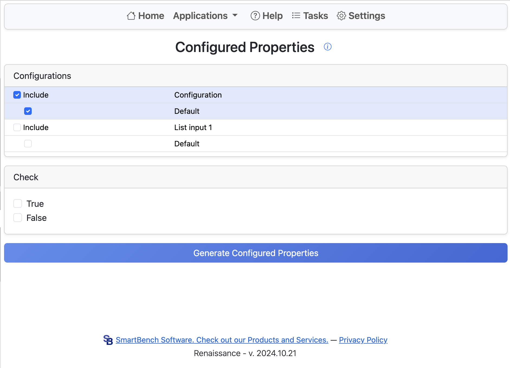

# Configured Properties

This application generates rows in the configured properties table.
Start by selecting all configuration options to include in generation.
Each possible combination of options is included in the resulting table.

When run, the application creates rows by setting the name of the part for that configuration.
The name will be the current name plus a sequential number.
Any rows that already exist in the configured properties table will have the name property replaced.

Once complete, you will receive an email notification.
