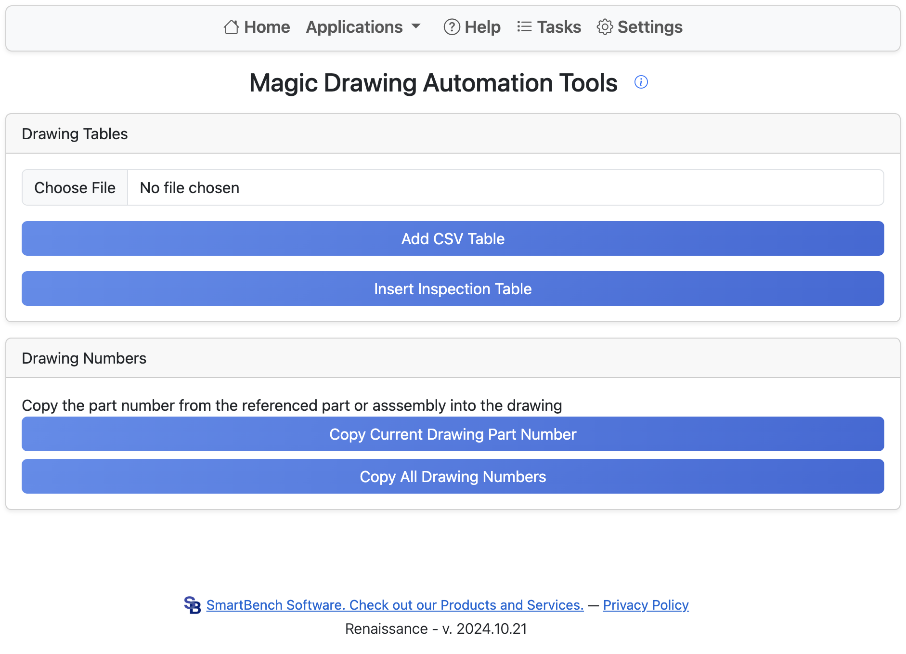

# Magic Drawings

Magic Drawings is a tool that adds additional functionality to Onshape drawings.

## Drawing Tables
Clicking **Add CSV Table** allows you to insert a CSV table into an Onshape drawing.
Clicking **Insert Inspection Table** allows you to insert an inspection table into an Onshape drawing.

## Drawing Numbers
Adds the part number from the associated assembly or part to the current drawing. 
Clicking **Copy Current Drawing Part Number** copies the part number into the current drawing, whereas clicking **Copy All Drawing Numbers** performs this process for every tab in the current document.