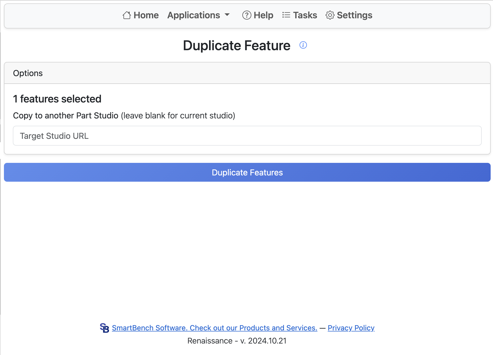

# Duplicate Feature

Duplicate feature allows you to easily duplicate an existing feature in a part studio.

Start by selecting a feature in the part studio with the applet open.

Enter the target studio URL

Click **Duplicate Features**.
