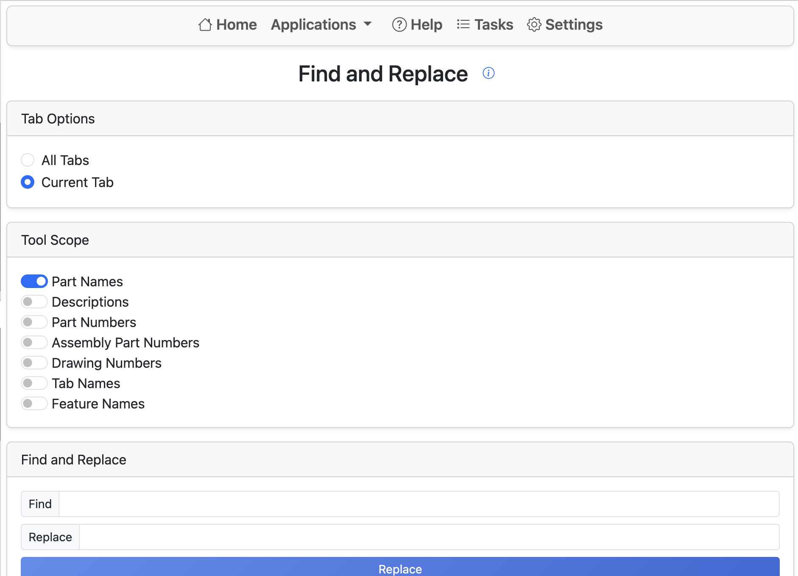

# Find and Replace

Find and Replace allows easy renaming of various elements in an Onshape document.
Start by selecting a scope: **current tab** or **all tabs**.
When **all tabs** is selected, only Part Studio contents will be modified, but all tab names will be updated.

Next, select which contexts to update. Find and Replace currently supports:

- Part Names
- Descriptions
- Part Numbers
- Feature Names
- Tab Names

Features with dynamic names (such as variables) are not supported.

Next, enter your search term under **Find** and the replacement term under **Replace**.
The search term is case-sensitive. All occurrences of the term will be replaced.
A preview is visible under the **Replace** button.

Clicking **Replace** begins the process. The user may close Renaissance while this runs.
The process may take a few minutes depending on the number of parts, features, tabs, and other items.
