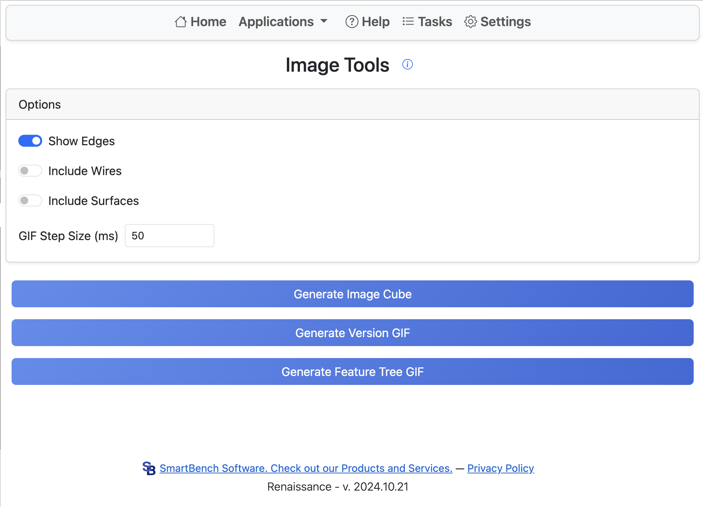

# Image Cube

This application generates images of the six orthogonal directions of the current Part Studio.
Selecting the option to use the configuration table allows generating images for many configurations at once.
If this option is not selected, the current studio configuration is used.

The configuration table run generates all possible combinations of the selected options.
Very large numbers of configurations are not supported. Anything over 500 combinations will not generate.

Supported image options:

- Show Edges
- Include Wire Bodies
- Include Surface Bodies
- Show All Parts: if selected, all parts are included; otherwise, only currently visible parts are exported.

Images are `400x400` for each orientation, with pixel size set so the image area is filled.
