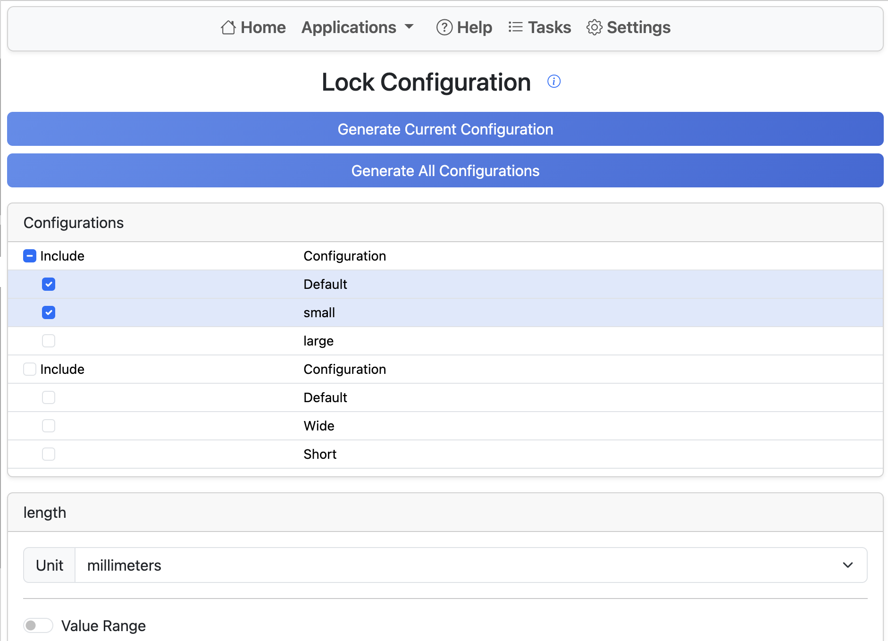

# Lock Configuration

This tool generates a new Part Studio with a derive feature that references the current Part Studio.
The configuration of the derive feature can be set to the current configuration, or multiple Part Studios can be created by selecting a range of configurations.
